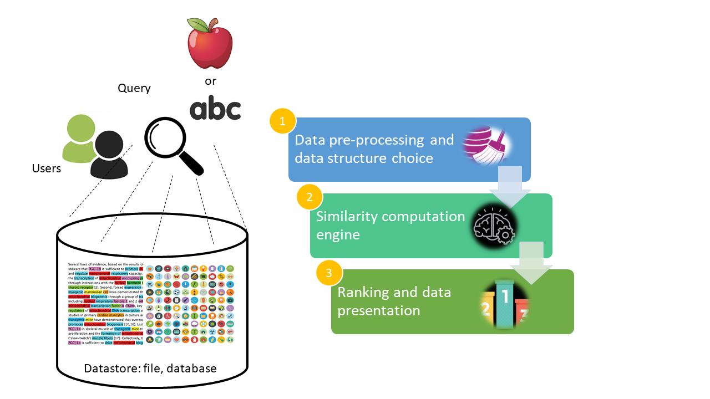

# phase2_latent_features

**Abstract**

One of the classic problems in the web domain is to yield the best results as 
part of a user query that can be in form of multimedia. There are various techniques 
one can employ for Information Retrieval (IR) from huge sets of multimedia consisting 
of text, images, audio, video, etc. In this phase, we focus on implementing a naive 
search engine by applying the concepts of vector models and similarity/distance measures 
for textual and visual descriptors of multimedia on a publicly available dataset comprising 
of various models to represent text and images.

The search engines may yield varying results based on their model implementation. We strongly 
focus on the use of proven similarity metrics like Cosine similarity, Euclidean distance and others 
that work well with text and images, to yield best results in the given time 
frame. We also employ state of the art techniques of dimensionality reduction using 
Principal Component Analysis (PCA), Singular Value Decomposition (SVD) and Latent Dirichlet Allocation (LDA).

**Introduction**

In this phase, we experiment with the dataset provided with respect to three entities - 
location, user and images where each user has clicked pictures at certain locations and has tagged them. 
It also provides two categories of information - some of the features are extracted for text (image tags, title) 
like TF, DF, TF-IDF forming a set of textual descriptors and various models for images like CN, CM, HOG, etc which 
are extracted from the images and form a set of visual descriptors. These descriptors help in creating a feature 
vector for each entity in the dataset and enable comparison between them by computing a similarity score using metrics 
(that work well with text and images) like Cosine similarity and Euclidean distance.

Steps to setup the project
1. Create a virtualenv in the local directory and activate the virtualenv
2. Maintain requirements.txt, but push the changes to requirements.txt which has main packages instead of all linked packages which come using pip freeze
3. pip install -r requirements.txt

Following libraries are used with python 3.5.2:
1. numpy==1.15.1
2. scikit-learn==0.19.2
3. scipy==1.1.0
4. sklearn==0.0
